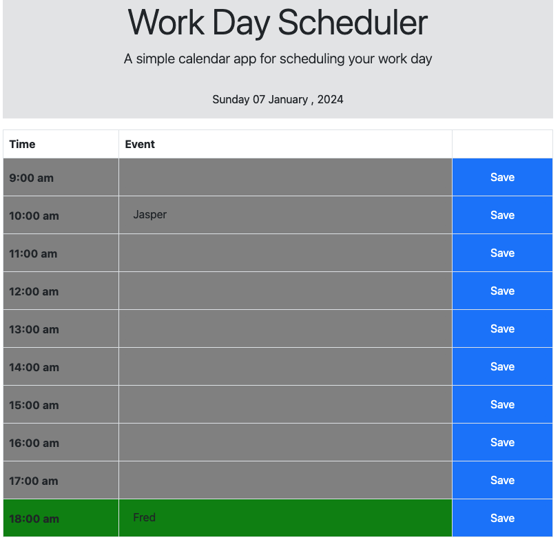

# Planner - A Work Day Scheduler

## Background

The goal is to create a simple calendar application that allows a user to save events for each hour of the day.

This planner is a work in progress and may change.

## User Story

```md
AS AN employee with a busy schedule
I WANT to add important events to a daily planner
SO THAT I can manage my time effectively
```

## Wireframe

An animated gif was provided of the planner. 


## Acceptance Criteria

The app should:

* Display the current day at the top of the calendar when a user opens the planner.
 
* Present time blocks for standard business hours when the user scrolls down.
 
* Color-code each time block based on past, present, and future when the time block is viewed.
 
* Allow a user to enter an event when they click a time block

* Save the event in local storage when the save button is clicked in that time block.

* Persist events between refreshes of a page


## Deliverable

Follow the link to view the planner landing page:

https://pine-box.github.io/planner/


Link to the repo:

https://github.com/Pine-Box/planner



